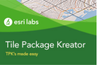

# Tile Package Kreator

Tile Package Kreator is a desktop utility that guides you in creating Tile Package files. Tile Package files are used by out of the box mobile apps like ArcGIS Survey123, ArcGIS QuickCapture, and ArcGIS Collector to take basemaps offline. Custom apps built with the ArcGIS Runtime SDK can also work with Tile Package files. Typically, Tile Package files are used to help bring basemaps for offline use. 

## How to use the app

You can download the app from these urls

http://links.esri.com/esrilabs/tile-package-kreator-windows

http://links.esri.com/esrilabs/tile-package-kreator-mac 

http://links.esri.com/esrilabs/tile-package-kreator-ubuntu

Or directly from the [Microsoft Store](https://www.microsoft.com/en-us/p/tile-package-kreator/9pm0rrbmcsrz).

Once downloaded on your Mac, Windows or Ubuntu Linux system, Tile Package Kreator will let you login into your own ArcGIS organization (ArcGIS Online or ArcGIS Enterprise) and easily define your area of interest as well as the number of levels of detail for your offline map.  You can define an area of interest based on a rectangle or along a predefined linear feature such as a road, river, pipe etc.  Tile Package Kreator will request the creation of the Tile Package file from the selected Tiled Map service and let you store it locally or in your own ArcGIS organization. Once a Tile Package file is created, it can be used with ArcGIS Survey123, ArcGIS QuickCapture, and ArcGIS Collector as well as ArcGIS Pro, ArcMap and custom apps built with the ArcGIS Runtime SDKs.

Download this [PDF document](http://links.esri.com/esrilabs/tile-package-kreator-help) for a handy help guide for using Tile Package Kreator.

## Requirements

<a href="http://www.esri.com/landing-pages/appstudio">AppStudio for ArcGIS</a> is required to compile the code in this repo.

## Issues

Find a bug or want to request a new feature?  Please let us know by submitting an issue.

## Contributing

Esri welcomes contributions from anyone and everyone. Please see our [guidelines for contributing](https://github.com/esri/contributing)

## Copyright and License

Copyright © 2021 Esri Inc.

Licensed under the Apache License, Version 2.0 (the "License");
you may not use this file except in compliance with the License.
You may obtain a copy of the License at

> http://www.apache.org/licenses/LICENSE-2.0

Unless required by applicable law or agreed to in writing, software
distributed under the License is distributed on an "AS IS" BASIS,
WITHOUT WARRANTIES OR CONDITIONS OF ANY KIND, either express or implied.
See the License for the specific language governing permissions and
limitations under the License.

A copy of the license is available in the repository's [LICENSE](./LICENSE) file.

